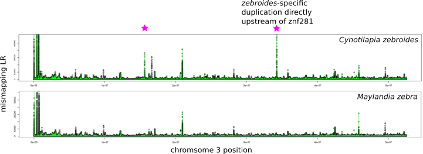

ngsParalog
==========

ngsParalog is a program for detecting genomic regions that are problematic for short reading mapping using population-level, next generation sequencing (NGS) data. 
ngsParalog implements a likelihood method for estimating the probability that reads covering a particular site are mismapped based on genotype likelihoods, 
which makes it effective at even very low sequencing depths (e.g. 2X per individual). Common approaches for identifying regions that confound short read mapping (caused by things like paralogy
and repetitive sequence for example) rely on inflated coverage or excess heterozygosity. We find that differences in sequencing depth tend to be less reliable than using signatures of excess
heterozygosity at low coverage, particurly when there is bias in mapping reads derived from different genomic regions. However, low depth hinders accurate genotype
calling thereby greatly diminishing power to  detect mapping problems based on excess heterozygosity. ngsParalog offers a solution to these problems through a likelihood
approach in which sequencing errors and within-individual read proportions are modeled, offering more power to detect mapping problems at lower FDR.
In addition, the dupHMM.R script implements a Hidden Markov Model to infer start and stop coordinates of regions refractory to short read mapping along large scaffolds based on both sequencing depth
and the ngsParalog mismapping LR statistic. This achieves higher accuracy for identifying regions of mismapping than coverage or excess heterozygosity alone, and can delineate
between signatures of excess heterozygosity due to balancing selection and mismapping.

## Installation

Clone the ngsParalog repository with the command:

% git clone https://github.com/tplinderoth/ngsParalog

To install ngsParalog run the commands:

% cd ngsParalog  
% make

To remove compilation products, run:

% cd ngsParalog  
% make clean

## Running ngsParalog

	./ngsParalog
	
	ngsParalog
	version 1.3.2
	
	Usage: ngsParalog [command] [arguments]
	
	Commands:
	
	calcLR      Calculate per site likelihood ratio of duplication
	findRegion  Find the coordinates of duplicated genomic regions

Note: Only the calcLR function is currently implemented. Use the dupHMM.R script to calculate start and stop coordinates of regions that have mapping problems for now.

### calcLR

This function will calculate a likelihood ratio (LR) of mismapping reads covering each site. This can be run on any type of genomic NGS data (WGS, RAD-seq, sequence-capture, etc). 
The input needs to be in [samtools](https://github.com/samtools/samtools) mpileup format. ngsParalog can be run over all sites whether variable or not, but SNPs are the 
only informative sites for the method so it is much more efficient to limit the input to variable sites. Column 5 of the output is the mismapping LRs, which are asymptotically 
distributed as a 50/50 mixture of a chi-square(1 d.f.) and chi-square(0 d.f.) under the null of no mapping problems. The LRs can be useful for quality control by enabling users 
to filter out sites from their datasets based on a staistical significance level of mapping problems, as well as serve as a means for discovering regions of biological interest 
such as duplications. 

	./ngsParalog calcLR
	
	Usage: ngsParalog calcLR [arguments]
	
	Arguments:
	
	-infile     <string>    Pileup format file of reads and quality scores; specifying '-' will read from STDIN []
	-outfile    <string>    Name of output file, if not provided results printed to STDOUT []
	-offsetQ    <float>     Quality score offset [33]
	-minQ       <float>     Minimum base quality score [20]
	-minind     <int>       Minimum number of covered individuals to retain site [1]
	-mincov     <int>       Minimum number of reads for an individual to be considered 'covered' [1]
	
	Output by field:
	(1) sequence ID
	(2) position in sequence (1-base indexed)
	(3) -log null likelihood
	(4) -log alternative likelihood
	(5) likelihood ratio of mismapped reads

### calcLR Example:

ngsParalog can take as input a premade mpileup format file. In this first example we will use some simulated mpileup data for 50 individuals sequenced to an average depth
of 2X at 100 SNPs. The first 50 SNPs have normal mapping, and the following 50 SNPs are paralogous.

	./ngsParalog calcLR -infile ./example/50n_2x.pileup -outfile ./example/50n_2x.lr -minQ 20 -minind 25 -mincov 1

OR, ngsParalog can read directly from STDIN. Here's how to read piped input directly from samtools:

	samtools mpileup -b <bam list> -l <snp position file> -q 0 -Q 0--ff UNMAP,DUP | ngsParalog calcLR -infile - -outfile <outfile name> -minQ 20 -minind 25 -mincov 1

ngsParalog needs to see all of the reads, hence you should take care not to filter out any reads at the stage of generating the pileup input (which is why
I explicitly show -q 0 and -Q 0 to ensure that reads are not removed based on mapping or base quality by samtools). User's may also need to use the samtools mpileup -d option
to ensure that reads are not truncated based on max depth limits. In the call to ngsParalog it's recommended to use a -minQ of around 20-30.

If the interest is to filter sites based on the mismapping LRs for quality-control purposes, the user can do this at a particular statistical threshold by comparing the
calculated LRs to the null distribution. The following R code will calculate p-values for the LRs, which can be used to filter sites after adjusting them for the
number of sites that were tested.

	R
	
	> lr <- read.table('./example/50n_2x.lr') # read in ngsParalog calcLR output
	> lr$pval <- 0.5*pchisq(lr$V5,df=1,lower.tail=FALSE) # append column of p-values
	> lr$pval.adj <- p.adjust(lr$pval, method="bonferroni") # p-values adjusted for number of tested sites
	
	# The 7th column of the lr data.frame is the adjusted p-value for rejecting the null hypothesis that reads
	# covering the site derive from a single locus. Of course you can use any p-value adjustment of your
	# choosing, e.g. "fdr".
	
	# generate list of sites that don't show evidence of mismapping at 0.05 significance level:
	> qc.sites <- lr[-which(lr$pval.adj < 0.05),1:2]

It can also be useful to generate Manhattan plots of the LRs. For example, below is a plot of the mismapping LRs for two closely-related
cichlid fish species revealing duplications unique to one of the species (denoted with stars). Peaks in the Manhattan plot represent regions of problematic
mapping.

## dupHMM

The dupHMM.R script models the LRs from calcLR and sequencing depth as emissions in a Hidden Markov Model to infer transitions between
problematic mapping and normal mapping regions along a chromosome. Since this is an HMM that runs along the length of a chromosome it
is most appropriate for data that has been mapped to a reference assembly with long scaffolds. Simulations demonstrate that this method
achieves higher accuracy for identifying regions of mismapping than using the LRs or coverage alone.

### R dependencies

* [truncnorm](https://cran.r-project.org/web/packages/truncnorm/index.html)
* [docopt](https://cran.r-project.org/web/packages/docopt/index.html)

### Running dupHMM.R

	./dupHMM.R --help
	Description:
	Infer regions of duplication from ngsParalog likelihood ratios and sequencing depth
			
	Usage:
	   dupHMM.R --lrfile=<likelihood ratio file> --outfile=<output prefix> [options]
	   dupHMM.R -h | --help
	   dupHMM.R --version
			
	Options:
	   --emit=<0|1>           Use (0) only LRs or (1) LRs and coverage as emissions [default: 1]            
	   --covfile=<file>       File with the average individual coverage for all sites in the LR file
	   --penalty=<character>  Penalize likelihood ratios using AIC, BIC, or none for no penalty [default: none]
	   --n=<int>              Diploid sample size (required for BIC)
	   --maxiter=<int>        Maximum number of Baum-Welch iterations [default: 100]
	   --probdiff=<float>     Minimum difference in log likelihood between Baum-Welch iterations [default: 1e-4]
	   --lrquantile=<float>   Ignore LRs above this quantile when fitting alternative LR distribution [default: 1.0]
	   --maxcoverage=<float>  Maximum coverage for fitting coverage distribution
	   --dupcovmin=<float>    Lower bound for duplicated coverage distribution [default: 0]
	   --paramOnly=<0|1>      Only estimate emission density params if 1 [default: 0]
	   --paramfile=<file>     File with emission density parameter estimates
	   --printStates=<0|1>    Output SNP states if 1 [default: 0] 

The only required input file is the output of calcLR supplied to --lrfile. In order to use both the LRs and coverage in the HMM an additional 3-column TSV file with
(1) chromosome, (2) posiiton, and (3) average individual sequencing depth must be supplied to --covfile. The positions in the LR and coverage files must be the same. 
dupHMM can only be run along one scaffold at a time, so it's recommended to train the HMM on the entire genome using --paramOnly 1 and then feed these estimated 
parameters to the program with --paramfile to infer the mapping states.

### Example:

	./dupHMM.R --lrfile ./example/hmm_region_LR.txt --outfile ./example/hmm_region --covfile ./example/hmm_region_coverage.txt --lrquantile 0.98

The output hmm_region.rf TSV file lists the regions (chromosome, start position, end position) that are problematic for short read mapping. These
regions could, for instance, represent duplications. The hmm_region.par file contains the fitted parameter values used for running the HMM,
and can be used in subsequent dupHMM.R runs with the --paramfile option.

## Author Details

Written by Tyler Linderoth  
Contact: tylerp.linderoth@gmail.com 
